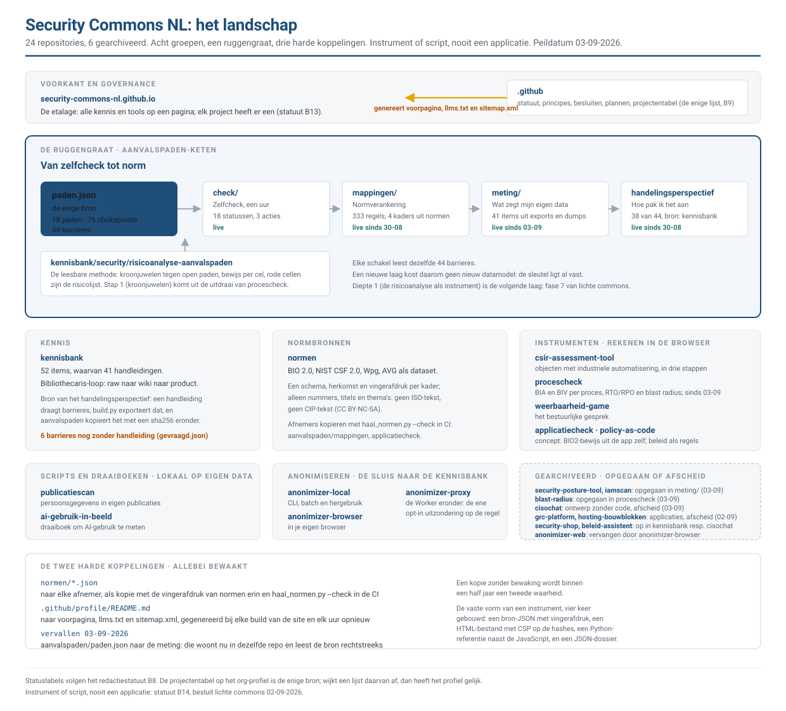
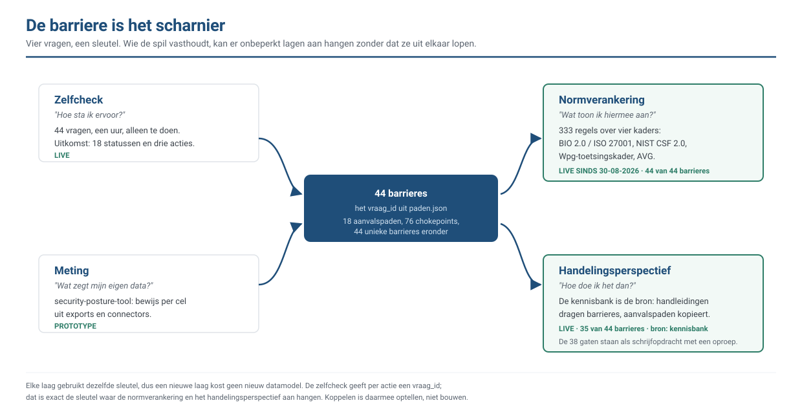

# Architectuur van Security Commons NL

Hoe het geheel in elkaar zit: welke repositories er zijn, hoe ze samenhangen, en waar het werk staat
dat nog gedaan moet worden. Bedoeld voor wie wil meebouwen en eerst wil begrijpen waar iets thuishoort.

Dit stuk beschrijft de structuur. Waarom we dit doen staat in [PRINCIPLES.md](PRINCIPLES.md), hoe we
schrijven in [REDACTIESTATUUT.md](REDACTIESTATUUT.md), en hoe je bijdraagt in
[CONTRIBUTING.md](CONTRIBUTING.md). De projectentabel op het
[organisatieprofiel](profile/README.md) is de enige projectenlijst; wijkt dit stuk daarvan af, dan
heeft het profiel gelijk.

**Peildatum: 2 september 2026** (bijgewerkt met het besluit *lichte commons*)**.** De rationalisatie uit
[het plan](plannen/2026-08-30-rationalisatie.md) is uitgevoerd: de security-shop is opgegaan in de
kennisbank, de kennisbank is de bron van het handelingsperspectief, en 35 van de 44 barrieres hebben
een handleiding. Daarna is *Meten voordat je ingrijpt* opgesplitst
([plan](plannen/2026-08-31-meten-voordat-je-ingrijpt-opsplitsen.md)): 49 items, 53 koppelingen, en het
veld `pijler` is zichtbaar geworden op de site. Op 1 en 2 september kwamen er twee repo's bij:
`csir-assessment-tool` (de CSIR in de browser, [plan](plannen/2026-09-01-csir-keten.md)) en
`applicatiecheck` (concept), en werd statuut B13 vastgesteld
([plan](plannen/2026-09-02-elk-project-een-pagina.md)).

---

## Het landschap

Drieëntwintig repositories, waarvan drie gearchiveerd. Ze vallen uiteen in zes groepen, met daaronder
drie harde datakoppelingen die het geheel bij elkaar houden.

### De ruggengraat: de aanvalspaden-keten

`paden.json` is de enige bron voor achttien aanvalspaden, 76 chokepoints en de **44 barrieres** die
daaronder liggen. Alles wat de keten doet, hangt aan die 44.

| Schakel | Wat het beantwoordt | Waar |
|---|---|---|
| Zelfcheck | Hoe sta ik ervoor? | `aanvalspaden/check/` |
| Risicoanalyse | Wat betekent dat voor mijn kroonjuwelen? | `kennisbank/security/risicoanalyse-aanvalspaden/` |
| Meting | Wat zegt mijn eigen data? | `security-posture-tool` |
| Normverankering | Wat toon ik hiermee aan? | `aanvalspaden/mappingen/` (30-08-2026) |
| Handelingsperspectief | Hoe doe ik het? | de **kennisbank** is de bron; `aanvalspaden` kopieert (30-08-2026) |

### Het criterium: instrument of script, nooit een applicatie

Sinds 2 september 2026 ([besluit](BESLUITEN.md), [plan](plannen/2026-09-02-lichte-commons.md)) is een
project in de projectentabel een van twee dingen. Een **instrument** rekent volledig in de browser: geen
server, geen account, geen telemetrie, geen staat buiten het apparaat van de gebruiker; dat is de norm en
het enige dat in de tabel *Live tool* heet. Een **script** draait lokaal op data die je al hebt, zonder
server en zonder eigen opslag; het staat in de tabel als *Leesbare versie* met een download en zegt in zijn
README waarom het geen instrument is. Een applicatie met backend, database, authenticatie of gedeelde staat
hoort niet in de commons. De ene uitzondering is `anonimizer-proxy`: infrastructuur, opt-in, met naam in
het besluitenlog.

De commons houdt daarmee geen register bij. Elk instrument levert een dossier als JSON dat de gebruiker
zelf bewaart en meeneemt naar zijn eigen managementsysteem.

De vaste vorm van een instrument, drie keer gebouwd en drie keer hetzelfde gebleken: één bron-JSON in
git met herkomst en vingerafdruk; één HTML-bestand met bron en app in één scripttag, één stylesheet en een
Content-Security-Policy op de sha256 van beide; een Python-referentie naast de JavaScript met dezelfde
functienamen; een dossier als JSON met de vingerafdruk van de bron erin; tests die de bron tegen het
origineel leggen, de bouw controleren en de app in Chromium doorlopen; uitleg via de gedeelde site-build
op `/<naam>/uitleg/`. De bouwplannen van de zelfcheck en de CSIR Assessment Tool zijn de uitgewerkte
voorbeelden.

### De zes groepen

**Voorkant.** `security-commons-nl.github.io` is de etalage. De voorpagina, `llms.txt` en `sitemap.xml`
worden gegenereerd uit de projectentabel in `.github/profile/README.md`; die tabel is de enige
projectenlijst (statuut B9).

**Kennis.** `kennisbank`, tweeënvijftig items, waarvan eenenveertig van het type
`handleiding`. Verdeeld over de vier vakgebieden is dat scheef: achtenveertig staan onder
`security`, twee onder `governance`, twee onder `bcm`, en `privacy` is nog leeg. Een handleiding draagt het veld `barrieres:` en is daarmee de bron van het
handelingsperspectief: `tools/build.py` exporteert `handelingsperspectief.json`, en `aanvalspaden`
kopieert dat met `tools/haal_handelingsperspectief.py`, met een sha256 eronder zodat een verlopen kopie
opvalt. Zo staat een handleiding op een plek in plaats van twee. Een barriere mag meer dan een
handleiding hebben; de rol (`fundering`, `alternatief`, `verdieping`) zegt waar je begint en wat
ernaast kan. Een stuk kan daarnaast een `pijler` dragen: dan hangt het onder een groter geheel, en tonen
de pijler en het stuk elkaar. Stand: 36 van de 44 barrieres gedekt met 55 koppelingen, 8 open, en die
acht staan met een schrijfopdracht in `aanvalspaden/mappingen/gevraagd.json`.

**Keten.** `aanvalspaden` en `security-posture-tool`, hierboven beschreven.

**Normbronnen.** `normen`: BIO 2.0, NIST CSF 2.0, het Wpg-toetsingskader en de AVG als dataset, elk in
één schema met herkomst en vingerafdruk, zonder ISO-tekst. De mappingen (welke barrière levert bewijs
voor welke maatregel) blijven bij de aanvalspaden; `normen` levert alleen de bronnen.

**Instrumenten.** `csir-assessment-tool` (de CSIR voor een object met industriële automatisering:
classificeren, bepalen, uitwerken), `weerbaarheid-game` (het bestuurlijke gesprek), `applicatiecheck`
(concept: BIO2-bewijs uit de applicatie zelf, in de browser), `policy-as-code` (concept: beleid als
uitvoerbare regels). **Wordt omgebouwd** naar de vorm hierboven: `procescheck` (BIA en BIV; nu React,
FastAPI en PostgreSQL) en `security-posture-tool` (diepte 2; nu FastAPI en SQLite), en de scanners
`blast-radius` en `iamscan` krijgen een browserversie naast de CLI.

**Neemt afscheid.** `grc-platform` (ISMS/PIMS/BCMS met tenants, RLS en AI-agents) is op 2 september 2026
gearchiveerd: het is de definitie van een applicatie en wordt nooit één pagina. De volledige historie
staat lokaal bewaard. `cisochat` (ontwerp voor een vCISO-agent, geen code) volgt zodra zijn
`data/bio2.json`, de bron van de normverankering, is verhuisd; `hosting-bouwblokken` zodra is beoordeeld
wat ervan als kennis verder leeft. Zie het plan voor de volgorde.

**Scanners.** Kleine CLI's die een concrete vraag beantwoorden uit data die je al hebt: `iamscan` (wie
kan root worden), `blast-radius` (wat valt om), `publicatiescan` (persoonsgegevens in eigen
publicaties), `ai-gebruik-in-beeld` (draaiboek om AI-gebruik te meten).

**Anonimiseren.** `anonimizer-local` (CLI), `anonimizer-browser` (in de browser) en `anonimizer-proxy`
(de Worker eronder). Dit is de sluis waarlangs materiaal de kennisbank in komt.

**Governance en infra.** `.github` draagt het redactiestatuut, de principes en de projectentabel.
`hosting-bouwblokken` (referentiearchitecturen voor hosten) wacht op het oordeel uit het plan *lichte
commons*: als de commons niets meer host, is er niets meer om te hosten.

### De drie harde koppelingen

Dit zijn de plekken waar twee repo's echt op elkaar leunen. Alle drie zijn ze bewaakt, want een kopie
zonder bewaking wordt binnen een half jaar een tweede waarheid.

1. `aanvalspaden/paden.json` → `security-posture-tool`, als kopie met een `paden.sha256` die bewaakt dat
   hij niet achterloopt.
2. `normen/*.json` → elke afnemer (`aanvalspaden/mappingen/bronnen/`, `applicatiecheck/bronnen/`), als
   kopie met de vingerafdruk van `normen` erin en een `tools/haal_normen.py --check` in de CI van de
   afnemer. Sinds 02-09-2026; daarvoor was `cisochat/data/bio2.json` de bron en had elke afnemer een
   eigen kopieerscript.
3. `.github/profile/README.md` → de voorpagina, `llms.txt` en `sitemap.xml`, gegenereerd bij elke build
   van `security-commons-nl.github.io`. Die repo checkt `.github` uit als `org-profile`, dus een wijziging
   in het profiel komt vanzelf mee; een push naar `.github` triggert die build niet, daarom draait hij ook
   elk uur.

---

---

## De barriere als scharnier

De achttien aanvalspaden delen **44 unieke barrieres**, en die zijn de spil van de hele keten. Aan
diezelfde sleutel hangen vier vragen:

| Vraag | Waar het antwoord staat | Stand |
|---|---|---|
| Hoe sta ik ervoor? | `aanvalspaden/check/` | live |
| Wat zegt mijn eigen data? | `security-posture-tool` | prototype |
| Wat toon ik hiermee aan? | `aanvalspaden/mappingen/` | live, 333 regels over vier kaders |
| Hoe pak ik het aan? | `kennisbank` (bron), gekopieerd naar `aanvalspaden/mappingen/` | live, 36 van de 44 barrieres |

Omdat elke laag dezelfde sleutel gebruikt, kost een nieuwe laag geen nieuw datamodel. De zelfcheck
geeft per aanbevolen actie een `vraag_id`; dat is exact de sleutel waar de normverankering en het
handelingsperspectief aan hangen. Koppelen is daarmee optellen, niet bouwen.

Een barriere kan **meerdere** handleidingen hebben, elk met een rol: een `fundering` en daarnaast
`alternatief` of `verdieping`. Voor 24/7 opvolging zijn dat er vijf: centrale logverzameling als
fundering, en vier manieren om de opvolging te organiseren. Zo krijgt de lezer een keuze in plaats van
een voorschrift.

Wat er per laag **niet** is, telt even zwaar als wat er wel is. De normverankering laat zien welke
maatregelen een dreigingsgerichte zelfcheck niet raakt; het handelingsperspectief laat zien voor welke
barrieres nog geen handleiding bestaat. Beide lijsten zijn afgeleid, dus ze lopen niet achter.

---

## Waar werk staat

Drie soorten, en het onderscheid is niet willekeurig.

| | Wat het is | Waar | Wie onderhoudt |
|---|---|---|---|
| **Sprong** | Iets dat er nog helemaal niet is: een nieuwe tool, een spelvorm, een aanpak | Issue met label `idee` | een mens bedenkt het |
| **Gat** | Iets dat ontbreekt in een structuur die er al staat | gegenereerd, op de site | een script rekent het uit |
| **Vraag** | Iets waarvan het antwoord bij een ander ligt | Discussions, categorie *Hulpvraag uit de praktijk* | wie de vraag stelt |

Een sprong is niet af te leiden: geen script stelt ooit voor om een spelvorm te bouwen die deelnemers
hun eigen kroonjuwelen laat benoemen. Een gat wel: "er is geen handleiding voor barriere `segment`"
volgt rechtstreeks uit `paden.json` en de kennisbank.

Een vraag is geen van beide. Hij is niet af te leiden en niet te bedenken, want het antwoord zit in de
praktijk van een andere organisatie. `gevraagd.json` lijkt erop maar is iets anders: daar staat wat er
geschreven moet worden en weten we al wat erin hoort. Bij een vraag weten we dat juist niet. Zie A11 van
het [redactiestatuut](REDACTIESTATUUT.md).

Daarom is er geen projectbord meer. Een gat dat je met de hand op een bord zet, loopt achter zodra
iemand het dicht, en dan houd je twee waarheden bij. Wat een script kan zien, houdt een script bij. En
wat alleen een ander kan weten, vraag je.

---

## Onderhoud

Een architectuurplaat die niet meebeweegt is binnen een half jaar misleidend. Twee dingen houden dit
stuk eerlijk:

1. **De projectentabel is de bron.** Komt er een repo bij, dan gaat die eerst in
   `profile/README.md`. Dit stuk volgt.
2. **De peildatum staat bovenaan.** Klopt hij niet meer met wat het profiel zegt, dan is dit stuk aan
   herziening toe.

Verbeteringen zijn welkom via een issue of een pull request.
