# Bijdragen aan security-commons-nl

Welkom. Dit is een kenniscommons voor CISO's en ISO's in de publieke sector. Iedereen die werkende kennis wil delen of verbeteren is welkom.

## Drie manieren om bij te dragen

### 1. Issue openen
Heb je een document, aanpak of idee, maar weet je niet precies hoe je het moet indienen? Open een issue. We helpen je verder.

→ Gebruik de template **"Bijdrage aanbieden"** als je iets wilt toevoegen.
→ Gebruik **"Fout of verbetering"** als iets niet klopt of beter kan.

### 2. Pull Request
Heb je een bestand klaarstaan? Fork de repo, voeg je bestand toe op de juiste plek, en stuur een pull request.

**Mapstructuur kennisbank:**
```
kennisbank/
├── security/    ← informatiebeveiliging (BIO, ISO 27001, etc.)
├── privacy/     ← privacy en gegevensbescherming (AVG, ISO 27701)
├── bcm/         ← bedrijfscontinuïteit (ISO 22301, BIA, etc.)
└── overig/      ← aanbestedingen, governance, overige kennis
```

**Bestandsnaamgeving:** beschrijvend en zonder spaties, bijv. `bia-template-gemeente.docx` of `privacybeleid-voorbeeld.pdf`.

**Anonimiseren:** zorg dat je document geen namen, emailadressen of andere persoonsgegevens bevat. Gebruik de [anonimizer](https://github.com/security-commons-nl/anonimizer-local) als die beschikbaar is, of vervang handmatig door functieomschrijvingen.

### 3. Meediscussiëren
Ga naar [Discussions](../../discussions) voor vragen, ervaringen en ideeën. Geen git-kennis vereist.

## Voor het eerst hier?

Nog nooit een issue geopend? Geen probleem. In vier stappen deel je een document, idee of verbetering.



### Per project: waar begin je

Klik op een van de onderstaande knoppen, er wordt een formulier voor je klaargezet. Je hoeft alleen de vragen in te vullen die voor jou relevant zijn, wij helpen je met de rest.

| Voor | Repository | Start hier |
|---|---|---|
| Iets delen over informatiebeveiliging, privacy of continuïteit | kennisbank | [Bijdrage aanbieden](https://github.com/security-commons-nl/kennisbank/issues/new?template=bijdrage-aanbieden.yml) |
| Bestuursdashboard (game) verbeteren of scenario toevoegen | weerbaarheid-game | [Bijdrage aanbieden](https://github.com/security-commons-nl/weerbaarheid-game/issues/new?template=bijdrage-aanbieden.yml) |
| Feedback op het GRC-platform | grc-platform | [Bijdrage aanbieden](https://github.com/security-commons-nl/grc-platform/issues/new?template=bijdrage-aanbieden.yml) |
| Testdocument of verbeterpunt voor anonimizer-local (de CLI) | anonimizer-local | [Bijdrage aanbieden](https://github.com/security-commons-nl/anonimizer-local/issues/new?template=bijdrage-aanbieden.yml) |
| Bug of feature-wens voor de browser-versie van de anonimizer | anonimizer-browser | [Bijdrage aanbieden](https://github.com/security-commons-nl/anonimizer-browser/issues/new/choose) |
| Ervaring met security-posture uit een interventie | security-posture-tool | [Bijdrage aanbieden](https://github.com/security-commons-nl/security-posture-tool/issues/new?template=bijdrage-aanbieden.yml) |
| Hosting-scenario of referentiearchitectuur | hosting-bouwblokken | [Bijdrage aanbieden](https://github.com/security-commons-nl/hosting-bouwblokken/issues/new?template=bijdrage-aanbieden.yml) |
| Idee voor de CISO-dirigent of beleidsondersteuning | cisochat | [Bijdrage aanbieden](https://github.com/security-commons-nl/cisochat/issues/new?template=bijdrage-aanbieden.yml) |
| Ervaring, vals-positief of nieuwe bron voor de publicatiescan | publicatiescan | [Bijdrage aanbieden](https://github.com/security-commons-nl/publicatiescan/issues/new?template=bijdrage-aanbieden.yml) |

### Geen GitHub-account?

Twee opties:

1. **Aanmelden duurt 2 minuten**, [github.com/signup](https://github.com/signup). Alleen e-mail en wachtwoord.
2. **Of vraag iemand in je netwerk** die al een account heeft om namens jou een issue te openen. De inhoud is wat telt, niet wie klikt.

### Wat kan ik verwachten?

- **Snelheid**: we reageren doorgaans binnen een week.
- **Privacy**: bevat je document persoonsgegevens? Meld het in het formulier, wij helpen je anonimiseren met de [anonimizer-local](https://github.com/security-commons-nl/anonimizer-local) vóór publicatie.
- **Erkenning**: bijdragen worden in de versiegeschiedenis zichtbaar vermeld, tenzij je anoniem wilt blijven.

## Documentatie bij software-repos

Elke repo begint met dezelfde kop; zie de [documentatiestandaard](DOCUMENTATION-STANDARD.md). De
controle `repo-compliance.yml` draait in elke repo en zegt precies wat er ontbreekt.

## Review

Pull requests worden beoordeeld door de maintainers. We kijken naar:
- Inhoudelijke relevantie
- Anonimisering (geen persoonsgegevens)
- Plaatsing in de juiste map
- Documentatie bijgewerkt (bij software-repos)

## Vragen?

Open een issue of start een discussie. We reageren zo snel mogelijk.
