# security-commons-nl

> Publieke organisaties bouwen samen aan digitale weerbaarheid — kennis, tooling en aanpakken die van ons allemaal zijn.

## Waarom dit bestaat

Nederlandse gemeenten en publieke organisaties werken voor hun meest kritieke processen — informatiebeveiliging, privacy en business continuity — intensief samen met externe partners. Die samenwerking is waardevol, maar vraagt tegelijkertijd om een sterke, onafhankelijke positie vanuit de overheid zelf.

Wanneer de inrichting van onze governance te veel afhankelijk wordt van de markt, geven we onbedoeld de regie uit handen. Echte controle eist publiek eigenaarschap.

Wij geloven dat:

- **Samen optrekken sterker is dan afzonderlijk inkopen.** Één enkele gemeente die het wiel opnieuw moet uitvinden, is kwetsbaar. Tien gemeenten die bestaande kennis en tools delen, vormen een robuuste beweging.
- **Ontwerpvrijheid (soevereiniteit) geen luxe is, maar een plicht.** Publieke data, publieke processen en publieke verantwoordelijkheid vragen om transparante en onafhankelijke tooling.
- **Open source de standaard moet zijn.** Publiek geld betekent publieke code, zodat iedere publieke organisatie mee kan profiteren en voortbouwen.
- **AI een middel is, geen doel.** Getraind en ingezet volgens onze eigen normen: bij voorkeur lokaal of EU-gehost, altijd ter ondersteuning en áltijd controleerbaar en transparant.

## Projecten

| Project | Status | Wat is het? | Doelgroep |
|---|---|---|---|
| [grc-platform](https://github.com/security-commons-nl/grc-platform) | Actief | GRC-platform voor ISMS, PIMS en BCMS in één systeem | CISO's, ISO's en privacy officers bij gemeenten |
| [weerbaarheid-game](https://github.com/security-commons-nl/weerbaarheid-game) | Actief | Interactief bestuursdashboard dat gemeentelijke kwetsbaarheid zichtbaar maakt | College van B&W, directies, bestuurders |
| [anonimizer](https://github.com/security-commons-nl/anonimizer) | Actief | AI-tool om gevoelige gegevens uit documenten te verwijderen | CISO's en ISO's die intern materiaal willen delen |
| [security-posture-tool](https://github.com/security-commons-nl/security-posture-tool) | Actief | Evidence-based security posture langs Defense-in-Depth | Blue teams en interventieteams |
| [kennisbank](https://github.com/security-commons-nl/kennisbank) | Actief | Gedeelde kennis van CISO's en ISO's in de publieke sector | CISO's en ISO's in de publieke sector |
| [hosting-bouwblokken](https://github.com/security-commons-nl/hosting-bouwblokken) | In ontwikkeling | Referentiearchitecturen en IaC voor veilige AI/security-hosting | Infra- en platformteams bij gemeenten |
| [beleid-assistent](https://github.com/security-commons-nl/beleid-assistent) | Concept | AI-ondersteunde beleidsassistent voor publieke organisaties | Beleidsmedewerkers en juridisch adviseurs |
| [cisochat](https://github.com/security-commons-nl/cisochat) | Concept | Chat met de gedachtegang van een CISO in de publieke sector | Security-professionals in de publieke sector |

## Meedoen

Dit is geen verkooppraatje. Er is niets te kopen.

Dit is een uitnodiging om samen te bouwen aan tooling die van ons allemaal is. Begin met kijken, draai het lokaal, geef feedback, of bouw mee.

Neem contact op via [LinkedIn](https://linkedin.com/in/bas-stevens), open een [discussion](https://github.com/security-commons-nl/.github/discussions) of een issue in een van de repositories.

## Voor het eerst hier?

Nog nooit een issue geopend? Geen probleem. In vier stappen deel je een document, idee of verbetering.

### Direct aan de slag

Klik op een van de onderstaande knoppen — er wordt een formulier voor je klaargezet. Je hoeft alleen de vragen in te vullen die voor jou relevant zijn, wij helpen je met de rest.

| Voor | Repository | Start hier |
|---|---|---|
| Iets delen over informatiebeveiliging, privacy of continuïteit | kennisbank | [Bijdrage aanbieden](https://github.com/security-commons-nl/kennisbank/issues/new?template=bijdrage-aanbieden.yml) |
| Bestuursdashboard (game) verbeteren of scenario toevoegen | weerbaarheid-game | [Bijdrage aanbieden](https://github.com/security-commons-nl/weerbaarheid-game/issues/new?template=bijdrage-aanbieden.yml) |
| Feedback op het GRC-platform | grc-platform | [Bijdrage aanbieden](https://github.com/security-commons-nl/grc-platform/issues/new?template=bijdrage-aanbieden.yml) |
| Testdocument of verbeterpunt voor de anonimizer | anonimizer | [Bijdrage aanbieden](https://github.com/security-commons-nl/anonimizer/issues/new?template=bijdrage-aanbieden.yml) |
| Ervaring met security-posture uit een interventie | security-posture-tool | [Bijdrage aanbieden](https://github.com/security-commons-nl/security-posture-tool/issues/new?template=bijdrage-aanbieden.yml) |
| Hosting-scenario of referentiearchitectuur | hosting-bouwblokken | [Bijdrage aanbieden](https://github.com/security-commons-nl/hosting-bouwblokken/issues/new?template=bijdrage-aanbieden.yml) |
| Idee voor een AI-beleidsassistent | beleid-assistent | [Bijdrage aanbieden](https://github.com/security-commons-nl/beleid-assistent/issues/new?template=bijdrage-aanbieden.yml) |
| Idee voor een CISO-chat | cisochat | [Bijdrage aanbieden](https://github.com/security-commons-nl/cisochat/issues/new?template=bijdrage-aanbieden.yml) |

### Geen GitHub-account?

Twee opties:

1. **Aanmelden duurt 2 minuten** — [github.com/signup](https://github.com/signup). Alleen e-mail en wachtwoord.
2. **Of vraag iemand in je netwerk** die al een account heeft om namens jou een issue te openen. De inhoud is wat telt, niet wie klikt.

### Wat kan ik verwachten?

- **Snelheid**: we reageren doorgaans binnen een week.
- **Privacy**: bevat je document persoonsgegevens? Meld het in het formulier — wij helpen je anonimiseren met de [anonimizer](https://github.com/security-commons-nl/anonimizer) vóór publicatie.
- **Erkenning**: bijdragen worden in de versiegeschiedenis zichtbaar vermeld, tenzij je anoniem wilt blijven.

## Principes

De architectuur- en communityprincipes die alle projecten sturen staan in [PRINCIPLES.md](https://github.com/security-commons-nl/.github/blob/main/PRINCIPLES.md).

## Over dit platform

Deze community staat momenteel op GitHub. Op termijn zullen we overstappen naar een EU-gebaseerd alternatief (zoals [Codeberg](https://codeberg.org)) — in lijn met onze principes van digitale soevereiniteit.

---

*Initiatief vanuit Gemeente Leiden — voor de hele publieke sector.*
